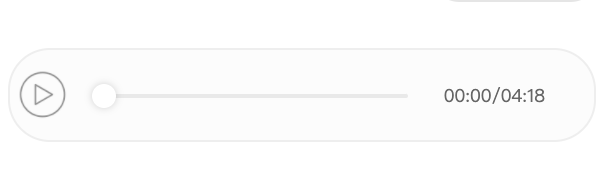
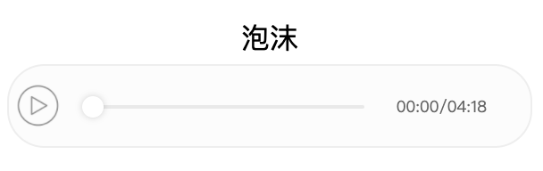
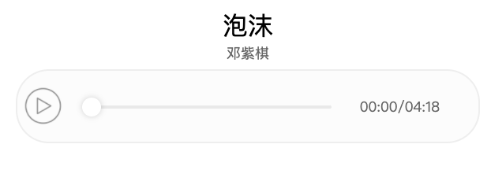
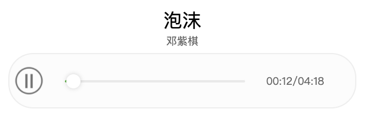
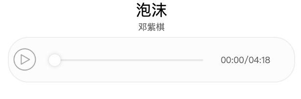
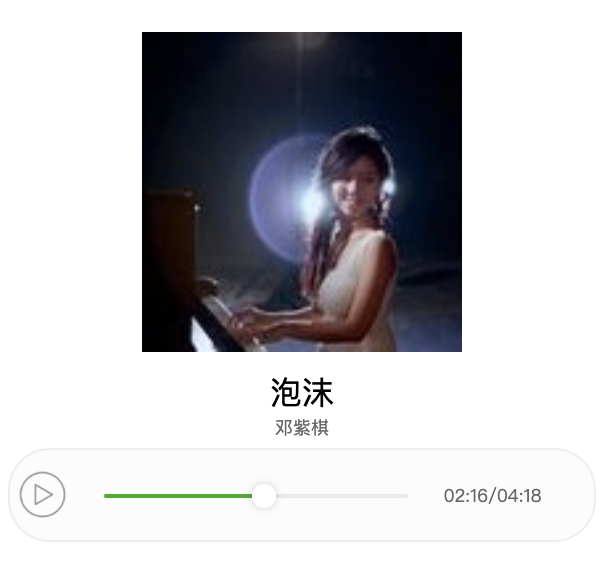

## 代码演示

#### 基础用法

通过`src`属性设置音频资源的地址

``` jsx
    <AudioPlayer src={'你的路径'}/>
```



#### 显示音频名称

通过`title`属性显示音频名称

``` jsx
    <AudioPlayer src={'你的路径'} title='泡沫'/>
```



#### 显示作者

通过`author`属性显示作者

``` jsx harmony
<AudioPlayer src={'你的路径'} title='泡沫' author='邓紫棋'/>
```



#### 自动播放

通过`autoplay`设置

```jsx harmony
<AudioPlayer src={'你的路径'} title='泡沫' author='邓紫棋' autoplay />
```



#### 进度条是否可拖拽

通过`draggable`设置
```jsx harmony
 <AudioPlayer src={'你的路径'} title='泡沫' author='邓紫棋' autoplay={true} draggable={false}/>
```


#### 设置海报
通过`poster`设置

```typescript jsx
<AudioPlayer src={'你的路径'} title='泡沫' author='邓紫棋' autoplay={false} draggable poster={'你的路径'}/>
```



### Props

| 参数 | 说明 | 类型 | 默认值 | 是否必须 |
|------|------|------|------|------|
| src | 音频资源的地址  | `string` | 无 | 是 |
| draggable | 是否可以拖动进度条 | `boolean` | true | 否 |
| title | 音频名称 | `string` | 无 | 否 |
| author | 音频作者 | `string` | 无 | 否 |
| autoplay | 是否自动播放 | `boolean` | `false`| 否 |
| poster | 音频海报 | `string` | 无 | 否 |
